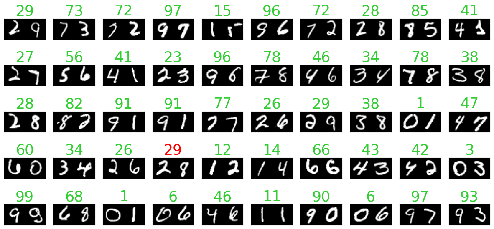

# Numbers recognition


## Overview

This project aims to build a neural network that can recognize handwritten numbers from images.
The project is designed for educational purposes, and leaves freedom of adjusting the parameters to the user, such as:
- the numbers of digits the model has to recognize
- the data augmentation parameters
- the number of layers of the convolutional neural networks
- the training parameters

and many more.

## Prerequisites

- Python 3.8 or above
- Pytorch
- Matplotlib
- Tensorboard

## Installation

Clone the repository to your local machine:

```bash
git clone https://github.com/Marcolino97do/Numbers_Recognition.git
```
Install the required packages using pip or conda. For pip run:
```bash
pip install -r requirements.txt
```
Or if you prefer conda:
```bash
conda env create -f environment.yml
```

Enter the source folder:
```bash
cd Numbers_Recognition/source
```
Execute the main.py file:
```bash
python3 main.py
```
After the first run, feel free to play with the parameters in the config module, 
and experiment with new modalities.

## Dataset Creation
For 1 digit recognition, the MNIST dataset is used, which is a dataset of handwritten digits.

For multiple digits recognition, a custom dataset is created by pasting together images from the MNIST dataset 
side by side, in order to reach the desired number of digits. 
Number of samples in the dataset can be increased to match the augmenting number of parameters of bigger models.

Once a custom dataset is created, it is stored in the data folder, and can be retrieved for faster future use.

## Training process
The model comes with pretrained model checkpoints, which are ready for inference and can be loaded using the load_model function in the train module.

if you want to train the model from scratch, you can simply set the number of epochs to train to be greater than 0 in main module.

Training saves model checkpoints every epoch. checkpoints can be evaluated using the model_evaluator module, in order to find the best model.
Validation accuracy and loss can be observed in real time using Tensorboard running the terminal command:
```bash
tensorboard --logdir logs
```

## Model Architecture
The model is a convolutional neural network, with 3 convolutional layers and 2 fully connected layers. 

The model is designed to be able to recognize up to 4 digits, but can be easily extended to recognize more digits.

The only bottleneck to model scaling is the number of parameters needed to construct the decoder of the neural network.
If instead of 2 fully connected layers as decoder we use a hardcoded decoder, the numbers of digits the model can recognize 
can be increased at will, since the model dimension would scale linearly with the number of digits to recognize.

## Results

Best accuracy for 1 digit: 0.9897, achieved at epoch 13

Best accuracy for 2 digits: 0.9592, achieved at epoch 20

Best accuracy for 3 digits: 0.9539, achieved at epoch 60

Best accuracy for 4 digits: 0.9223, achieved at epoch 275

## Limitations
You should not try to train the model to recognize more than 4 digits. In fact, the bare minimum of parameters needed 
to construct the fully connected decoder of the neural network is n*10^(n+1), where n is the number of digits to recognize. So for 5 digits,
you already exceed 5 million parameters.

